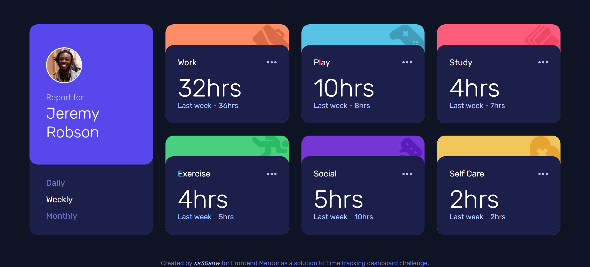

# Frontend Mentor - Time Tracking Dashboard

This is a solution to [Time Tracking Dashboard challenge on Frontend Mentor](https://www.frontendmentor.io/challenges/time-tracking-dashboard-UIQ7167Jw).

## Screenshot

## Ideas for improvement

- [ ] Display 'hr' and 'hrs' depending on number of hours taken from the database.